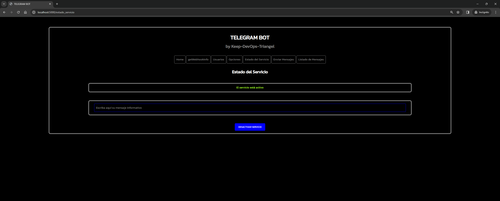

# Python Flask App with MySQL - Telegram Bot

Aplicación para crear un Bot de Telegram usando la API oficial ([python-telegram-bot](https://core.telegram.org/bots/api)). La aplicación está desarrollada con Python para construir las funciones del Bot, despliega una interfaz web con Python Flask para gestionar los datos del Bot y almacena esos datos en una base de datos MySQL.

## Author

RAFAEL TORICES

## Descripción

La aplicación crea un Bot de Telegram que permite interactuar con el usuario que lo inicia a través de la app oficial de Telegram, respondiendo y enviando información sobre las peticiones de los usuarios a través de opciones que se le envían a la app. Las opciones se obtienen de una base de datos y son personalizables a través de la interfaz web de la aplicación. Además, dicha interfaz web permite gestionar los usuarios que pueden interactuar con el Bot pudiendo activarlos o desactivarlos, permite enviarles mensajes directos a través del Bot a la app de Telegram, permite activar/desactivar el servicio...
Los datos de la aplicación se almacenan en la base de datos y son accesibles a través de la interfaz web.

## Requisitos previos

- Tener una cuenta oficial de Telegram
    - (https://web.telegram.org/k/)
- Tener la app oficial de Telegram instalada en un dispositivo
    - (https://play.google.com/store/apps/details?id=org.telegram.messenger&hl=es&gl=US)
    - (https://apps.apple.com/es/app/telegram-messenger/id686449807)
- Tener un Bot de Telegram creado a través de BotFather (herramienta oficial de Telegram para crear Bots que nos devolverá el **Token** del Bot que usaremos para configurar la aplicación)
    - (https://t.me/botfather)
    - (https://core.telegram.org/bots#6-botfather)
- Tener un certificado SSL válido para la URL que se establezca en la variable de entorno **URL_WEBHOOK** del fichero **.env**.
    > Este requisito es exigido por Telegram para establecer el webhook que recibe las request del Bot. Para más información, consultar la documentación oficial de Telegram: https://core.telegram.org/bots/api#setwebhook


## Requisitos técnicos

- Python 3.10 o superior para la aplicación
  - (https://www.python.org/downloads/)
- Python Flask para la interfaz web
  - (https://pypi.org/project/Flask/)
- MySQL 8.0 para la base de datos
  - (https://dev.mysql.com/downloads/mysql/)
- Python mysql-connector-python para la conexión de Python con la base de datos MySQL
  - (https://pypi.org/project/mysql-connector-python/)
- > Se incluye el fichero **requirements.txt** con las dependencias de Python necesarias para la aplicación

## Estructura del proyecto

- **config**: ficheros de configuración de la aplicación, incluyendo el fichero de configuración de la base de datos MySQL (db.sql).
- **images**: imágenes para el fichero Readme.md.
- **src**: código fuente de la aplicación.
  - **application**: código fuente de la aplicación web Python Flask.
    - **static**: ficheros estáticos de la aplicación web.
      - **css**: ficheros CSS de estilos de la aplicación web.
    - **templates**: ficheros HTML de la aplicación web.
    - **config.py**: fichero de configuración del Bot.
    - **estado.py**: fichero con las funciones de estado del Bot.
    - **metodos.py**: fichero con las funciones de los métodos del Bot.
    - **mysql.py**: fichero con la config de la base de datos MySQL para el Bot.
    - **opciones.py**: fichero con las funciones de las opciones del Bot.
    - **respuesta.py**: fichero con las funciones de respuesta del Bot.
    - **servicio.py**: fichero con las funciones del servicio del Bot.
    - **usuarios.py**: fichero con las funciones de los usuarios del Bot.
    - **web.py**: fichero con las funciones de la aplicación web Python Flask.
  - **tests**: ficheros de test de la aplicación.
  - **app.py**: fichero principal de la aplicación.
- **docker-compose.yml**: fichero de Docker-Compose para el despliegue de la aplicación.
- **Dockerfile**: fichero de Docker con la imagen de la aplicación.
- **env_example**: fichero de ejemplo para las variables de entorno necesarias para el despliegue de la aplicación.
- **README.md**: fichero con la documentación de la aplicación.
- **requirements.txt**: fichero con las dependencias de la aplicación.

## Despliegue de la aplicación en local para desarrollo

> ### Una vez configurados los requisitos previos e instalados los requisitos técnicos, para desplegar la aplicación en local para desarrollo, seguir los siguientes pasos:
> NOTA: La interacción con el Bot de Telegram no se podrá realizar en local, ya que es necesario que el Bot esté desplegado en un servidor accesible desde Internet con un certificado SSL válido para que Telegram pueda establecer el webhook que recibe las request del Bot. Para más información, consultar la documentación oficial de Telegram: https://core.telegram.org/bots/api#setwebhook
>
> -----

1. Clonar el repositorio en local:

```bash
git clone
```
2. Crear el fichero .env en la raíz del proyecto con las variables de entorno necesarias para el despliegue de la aplicación:

```bash
.env
```
3. Crear un entorno virtual de Python:

```bash
python -m venv venv
```
4. Activar el entorno virtual de Python:

```bash
source venv/bin/activate
```
5. Instalar las dependencias de Python:

```bash
pip install -r requirements.txt
```
7. Crear la base de datos MySQL con la configuración del fichero **db.sql**:
  
  ```bash
  Por ejemplo con Docker:

  docker run -d --name mysql -p 3306:3306 --env-file=.env mysql:8.0
  ```

6. Levantar la aplicación:

```bash
python src/app.py
```
7. Acceder a la aplicación web Python Flask en el navegador:

```bash
http://localhost:5000
```

## Despliegue de la aplicación en local mediante Docker Compose

> ### **IMPORTANTE**:
>Se debe disponer de un fichero **.env** en la raiz del proyecto, con una estructura similar al fichero de ejemplo **env_example** incluído en el repositorio, que contenga las variables de entorno necesarias para el despliegue de la aplicación. Configurar con los siguientes valores antes de levantar Docker Compose para que la aplicación funcione correctamente:
> ### - Variables de entorno para el funcionamiento del Bot Telegram:
>  - **URL_WEBHOOK**: URL del webhook que recibe las request del Bot **(OBLIGATORIO)**
>   - **TOKEN**: Token del Bot de Telegram **(OBLIGATORIO)**
>   - **TITULO_APP**: Título de la aplicación que se muestra en los mensajes del Bot **(OBLIGATORIO)**
>   - **TELEFONO_SOPORTE**: Teléfono de contacto que se muestra en los mensajes del Bot (OPCIONAL)
>   - **CHAT_ID_SOPORTE**: CHAT_ID de Telegram del administrador del Bot **(OBLIGATORIO)**
>     - Para obtenerlo, podemos usar el Bot de Telegram [@userinfobot](https://t.me/userinfobot). Al iniciarlo nos mostrará nuestro CHAT_ID.
>   - **EMAIL_SOPORTE**: Email de contacto que se muestra en los mensajes del Bot (OPCIONAL)
> --------

> ### - Variables de entorno para MySQL
>   - **MYSQL_DATABASE** - **(OBLIGATORIO)**
>   - **MYSQL_USER** - **(OBLIGATORIO)**
>   - **MYSQL_PASSWORD** - **(OBLIGATORIO)**
>   - **MYSQL_HOST** - **(OBLIGATORIO)**
>   - **MYSQL_PORT** - **(OBLIGATORIO)**
> ------

### Una vez configuradas las variables de entorno, para desplegar la aplicación en local mediante Docker Compose, seguir los siguientes pasos:

1. Clonar el repositorio en local:

```bash
git clone
```

2. Crear el fichero .env en la raíz del proyecto con las variables de entorno necesarias para el despliegue de la aplicación:

```bash
.env
```

3. Levantar Docker-Compose:

```bash
docker-compose up -d
```

4. Acceder a la aplicación web Python Flask en el navegador:

```bash
http://localhost:5000
```

## Funcionamiento de la aplicación

### Bot de Telegram

- Buscar el Bot de Telegram en la app oficial de Telegram con el nombre que se haya configurado en la variable de entorno **TITULO_APP** del fichero **.env**.
- Una vez localizado, iniciar con el comando **/start** que aparece en la app.
- Al iniciar el Bot de Telegram, se muestra un mensaje de bienvenida y se le informa que el administrador del Bot ha recibido una notificación para que le active el servicio.
- El administrador del Bot (CHAT_ID configurado en la variable de entorno **CHAT_ID_SOPORTE** del fichero **.env**) recibe una notificación en la app de Telegram con el mensaje del usuario que ha iniciado el Bot.
- El administrador del Bot puede activar el servicio para el usuario a través de la interfaz web de la aplicación.
- Una vez activado el servicio, el usuario puede interactuar con el Bot a través de las opciones que se le muestran en la app de Telegram.
- Si el usuario envía un mensaje al Bot que no es una opción disponible, el Bot le responde con un mensaje informándole que entiende lo que le dice y le muestra las opciones disponibles para que elija una.
- Si el usuario no ha sido activado por el administrador del Bot, el Bot le responde con un mensaje informándole que no ha sido activado y que el servicio no es accesible para él.

### Interfaz web

- Acceder a la aplicación web Python Flask en el navegador.
- Aparece una interfaz web con las opciones disponibles para gestionar el Bot de Telegram.

  ### Opciones disponibles:

  - **WebhookInfo**: muestra la información del webhook del Bot. Desde esta opción se puede obtener la información del webhook, establecer uno nuevo, eliminarlo o actualizarlo.
  - **Usuarios**: muestra la lista de usuarios que pueden interactuar con el Bot y su estado. Desde esta opción se pueden activar/desactivar usuarios.
  - **Opciones**: muestra la lista de opciones disponibles para el Bot. Desde esta opción se pueden editar las opciones disponibles que se muestran en la app de Telegram.
  - **Servicio**: muestra el estado del servicio del Bot. Desde esta opción se puede activar/desactivar el servicio. Si se desactiva el servicio (nos pedirá una causa), los usuarios que interactúen con el Bot recibirán un mensaje informándoles de que el servicio está desactivado por la causa especificada y no podrán interactuar con el Bot. Si se activa el servicio, los usuarios que interactúen con el Bot recibirán un mensaje informándoles de que el servicio está activado y podrán interactuar con el Bot.
  - **Enviar Mensajes**: opción para enviar mensajes directos a los usuarios que pueden interactuar con el Bot.
  - **Listado Mensajes**: muestra el listado de mensajes que los usuarios han enviado al Bot.

## Imágenes de la aplicación

  ### Interfaz web
  

  

  

  

  

  

  ### Bot en la App Telegram

  

  

  

## Fuentes

- https://core.telegram.org/bots/api
- https://python-telegram-bot.readthedocs.io/en/stable/
- https://flask.palletsprojects.com/en/2.0.x/
- https://dev.mysql.com/doc/connector-python/en/
- https://docs.docker.com/compose/
- https://www.docker.com/get-started/
- https://www.python.org/
- https://www.mysql.com/

