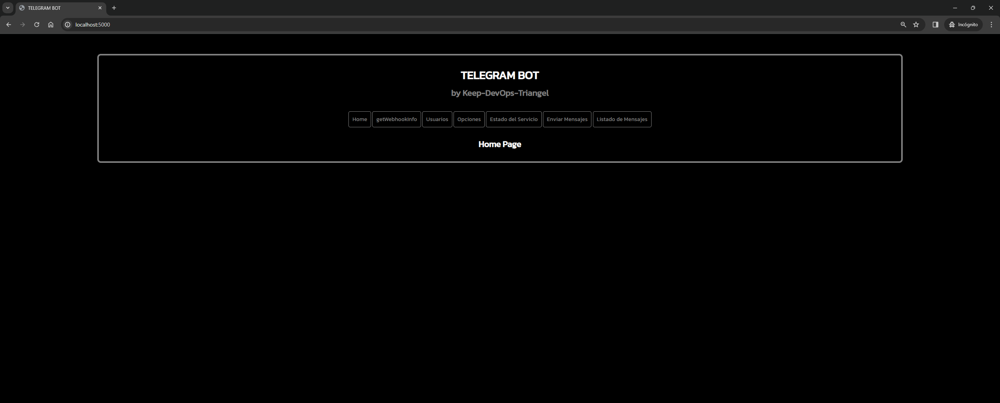

# Python Flask App with MySQL - Telegram Bot

Aplicación con Python Flask y MySQL para crear un Bot de Telegram ([python-telegram-bot](https://core.telegram.org/bots/api)).

## Author

RAFAEL TORICES

## Descripción

La aplicación crea un Bot de Telegram que permite interactuar con el usuario que inicia el Bot, respondiendo y enviando información sobre las peticiones de los usuarios a través de opciones que se muestran en la aplicación de Telegram. Las opciones del menú se obtienen de una base de datos MySQL y son personalizables a través de una aplicación web Python Flask. Además, la aplicación web permite gestionar los usuarios que pueden interactuar con el Bot, permite enviarles mensajes directos a través del Bot y permite activar/desarctivar el servicio del Bot. La base de datoas MySQL almacena la información de los usuarios que interactúan con el Bot y la información de todos los mensajes que se envían/reciben a través del Bot.

## Requisitos

- Python 3.10 o superior (https://www.python.org/downloads/)
- MySQL 8.0 (https://dev.mysql.com/downloads/mysql/)
- Python mysql-connector-python (https://pypi.org/project/mysql-connector-python/)
- Python Flask (https://pypi.org/project/Flask/)
- ### **REQUISITO OBLIGATORIO PARA EL FUNCIONAMIENTO DEL BOT**:
    > Es requisito obligatorio para el funcionamiento del Bot de Telegram establecer nuestro Webhook apuntando a una URL que sea accesible desde Internet y que disponga de un certificado SSL válido. Establecer esa URL en la variable de entorno **URL_WEBHOOK** del fichero **.env** y setear el Webhook desde la aplicación web Python Flask.

## Estructura del proyecto

- **config**: ficheros de configuración de la aplicación, incluyendo el fichero de configuración de la base de datos MySQL (db.sql).
- **images**: imágenes para el fichero Readme.md.
- **src**: código fuente de la aplicación.
  - **application**: código fuente de la aplicación web Python Flask.
    - **static**: ficheros estáticos de la aplicación web.
      - **css**: ficheros CSS de estilos de la aplicación web.
    - **templates**: ficheros HTML de la aplicación web.
    - **config.py**: fichero de configuración del Bot.
    - **estado.py**: fichero con las funciones de estado del Bot.
    - **metodos.py**: fichero con las funciones de los métodos del Bot.
    - **mysql.py**: fichero con la config de la base de datos MySQL para el Bot.
    - **opciones.py**: fichero con las funciones de las opciones del Bot.
    - **respuesta.py**: fichero con las funciones de respuesta del Bot.
    - **servicio.py**: fichero con las funciones del servicio del Bot.
    - **usuarios.py**: fichero con las funciones de los usuarios del Bot.
    - **web.py**: fichero con las funciones de la aplicación web Python Flask.
  - **tests**: ficheros de test de la aplicación.
  - **app.py**: fichero principal de la aplicación.
- **docker-compose.yml**: fichero de Docker-Compose para el despliegue de la aplicación.
- **Dockerfile**: fichero de Docker con la imagen de la aplicación.
- **env_example**: fichero de ejemplo de las variables de entorno necesarias para el despliegue de la aplicación.
- **README.md**: fichero con la documentación de la aplicación.
- **requirements.txt**: fichero con las dependencias de la aplicación.

## Despliegue de la aplicación en local mediante Docker-Compose

> ### **IMPORTANTE**:
>El fichero **docker-compose.env** contiene las variables de entorno necesarias para el despliegue de la aplicación. Configurar con los siguientes valores antes de levantar Docker-Compose para que la aplicación funcione correctamente:
> ### - Variables de entorno para el funcionamiento del Bot Telegram:
>   - **TOKEN**: Token del Bot de Telegram (OBLIGATORIO) https://core.telegram.org/bots/api
>   - **TITULO_APP**: Título de la aplicación que se muestra en los mensajes del Bot (OBLIGATORIO)
>   - **TELEFONO_SOPORTE**: Teléfono de contacto que se muestra en los mensajes del Bot (OPCIONAL)
>   - **CHAT_ID_SOPORTE**: CHAT_ID de Telegram del administrador del Bot (OPCIONAL / RECOMENDADO)
>   - **EMAIL_SOPORTE**: Email de contacto que se muestra en los mensajes del Bot (OPCIONAL)
> ### - Variables de entorno para MySQL
>   - **MYSQL_DATABASE**: Nombre de la base de datos MySQL (OBLIGATORIO)
>   - **MYSQL_USER**: Usuario de la base de datos MySQL (OBLIGATORIO)
>   - **MYSQL_PASSWORD**: Contraseña del usuario de la base de datos MySQL (OBLIGATORIO)
>   - **MYSQL_HOST**: Host de la base de datos MySQL (OBLIGATORIO)
>   - **MYSQL_PORT**: Puerto de la base de datos MySQL (OBLIGATORIO)
>
> ### **NOTA:** se incluye el fichero env_example para facilitar la configuración de las variables de entorno. Cumplimentar con los valores necesarios y renombrar a **.env**.
> ------

1. Clonar el repositorio en local:

```bash
git clone
```

2. Crear el fichero .env en la raíz del proyecto con las variables de entorno necesarias para el despliegue de la aplicación:

```bash
.env
```

3. Levantar Docker-Compose:

```bash
docker-compose up -d
```

4. Acceder a la aplicación web Python Flask en el navegador:

```bash
http://localhost:5000
```




